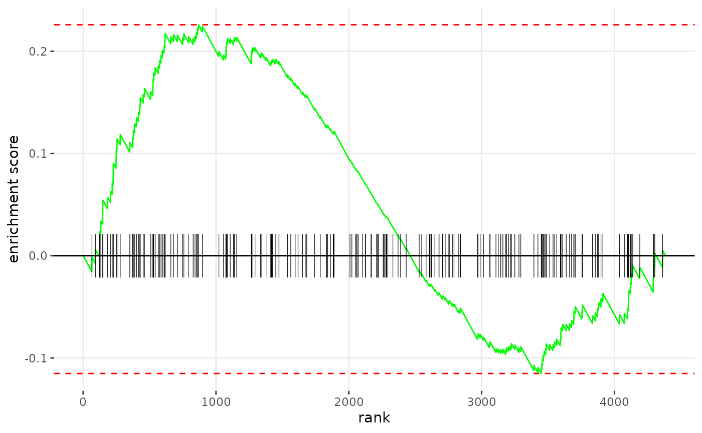

# Getting Started with ultragsea

## Introduction

ultragsea is a novel, ultrafast and memory optimized gene set enrichment
scoring algorithm not unlike fGSEA. ultragsea demonstrates highly
correlated gene set scores and p-values and typically is 100 times
faster than fGSEA.

## Example

### Preparing gensets

For this vignette, our package includes a small subset of the the pmbc3k
single-cell dataset of just 50 cells. Please install the Seurat and
SeuratData packages if you want to run this vignette against the full
dataset.

``` r
library("ultragsea")
library("msigdbr")
gs <- msigdbr::msigdbr(collection = "H")
gmt <- tapply(gs$gene_symbol,gs$gs_name,list)
length(gmt)
#> [1] 50
```

### Performing the statistical test

``` r
G <- gmt2mat(gmt)
fc <- rnorm(nrow(G))
names(fc) <- rownames(G)
res <- ultragsea(fc, G, format='as.gsea', method='ztest')
head(res)
#>                               pathway      pval      padj log2err    ES
#>                                <char>     <num>     <num>   <num> <num>
#> 1:           HALLMARK_APICAL_JUNCTION 0.8340206 0.9703000      NA    NA
#> 2:           HALLMARK_HEME_METABOLISM 0.8732700 0.9703000      NA    NA
#> 3:     HALLMARK_INFLAMMATORY_RESPONSE 0.7109902 0.9703000      NA    NA
#> 4:         HALLMARK_KRAS_SIGNALING_UP 0.9758927 0.9758927      NA    NA
#> 5: HALLMARK_OXIDATIVE_PHOSPHORYLATION 0.8634175 0.9703000      NA    NA
#> 6:              HALLMARK_ADIPOGENESIS 0.2248032 0.7025100      NA    NA
#>            NES  size                             leadingEdge
#>          <num> <int>                                  <list>
#> 1:  0.20954783   200 CRAT,HRAS,INSIG1,PIK3R3,ACTN2,ADAM9,...
#> 2:  0.15950628   200    CA2,BNIP3L,CDC27,H1-0,BCAM,BLVRA,...
#> 3:  0.37052654   200    IL4R,CCL2,HBEGF,INHBA,ITGB3,EREG,...
#> 4: -0.03021859   200        BMP2,CCND2,LIF,CFB,CSF2,PLAT,...
#> 5: -0.17202545   200     ACAA1,DLD,SDHC,ECHS1,GPI,GRPEL1,...
#> 6:  1.21385477   200  ALDOA,ECH1,GPX4,CRAT,DHCR7,GADD45A,...
```

### Plotting

``` r
fgsea::plotEnrichment(gmt[[1]], fc,ticksSize = 0.2)
```



## Benchmarking

## Session info

``` r
sessionInfo()
#> R version 4.5.2 (2025-10-31)
#> Platform: x86_64-pc-linux-gnu
#> Running under: Ubuntu 24.04.3 LTS
#> 
#> Matrix products: default
#> BLAS:   /usr/lib/x86_64-linux-gnu/openblas-pthread/libblas.so.3 
#> LAPACK: /usr/lib/x86_64-linux-gnu/openblas-pthread/libopenblasp-r0.3.26.so;  LAPACK version 3.12.0
#> 
#> locale:
#>  [1] LC_CTYPE=C.UTF-8       LC_NUMERIC=C           LC_TIME=C.UTF-8       
#>  [4] LC_COLLATE=C.UTF-8     LC_MONETARY=C.UTF-8    LC_MESSAGES=C.UTF-8   
#>  [7] LC_PAPER=C.UTF-8       LC_NAME=C              LC_ADDRESS=C          
#> [10] LC_TELEPHONE=C         LC_MEASUREMENT=C.UTF-8 LC_IDENTIFICATION=C   
#> 
#> time zone: UTC
#> tzcode source: system (glibc)
#> 
#> attached base packages:
#> [1] stats     graphics  grDevices utils     datasets  methods   base     
#> 
#> other attached packages:
#> [1] msigdbr_25.1.1    ultragsea_0.99.12 BiocStyle_2.38.0 
#> 
#> loaded via a namespace (and not attached):
#>  [1] sass_0.4.10              generics_0.1.4           fgsea_1.36.0            
#>  [4] lattice_0.22-7           digest_0.6.38            magrittr_2.0.4          
#>  [7] RColorBrewer_1.1-3       evaluate_1.0.5           sparseMatrixStats_1.22.0
#> [10] grid_4.5.2               bookdown_0.45            fastmap_1.2.0           
#> [13] jsonlite_2.0.0           Matrix_1.7-4             BiocManager_1.30.27     
#> [16] scales_1.4.0             codetools_0.2-20         textshaping_1.0.4       
#> [19] jquerylib_0.1.4          cli_3.6.5                rlang_1.1.6             
#> [22] cowplot_1.2.0            withr_3.0.2              cachem_1.1.0            
#> [25] yaml_2.3.10              tools_4.5.2              parallel_4.5.2          
#> [28] BiocParallel_1.44.0      dplyr_1.1.4              ggplot2_4.0.1           
#> [31] fastmatch_1.1-6          curl_7.0.0               assertthat_0.2.1        
#> [34] babelgene_22.9           vctrs_0.6.5              R6_2.6.1                
#> [37] matrixStats_1.5.0        lifecycle_1.0.4          fs_1.6.6                
#> [40] ragg_1.5.0               pkgconfig_2.0.3          desc_1.4.3              
#> [43] pkgdown_2.2.0            pillar_1.11.1            bslib_0.9.0             
#> [46] gtable_0.3.6             glue_1.8.0               data.table_1.17.8       
#> [49] Rcpp_1.1.0               systemfonts_1.3.1        xfun_0.54               
#> [52] tibble_3.3.0             tidyselect_1.2.1         MatrixGenerics_1.22.0   
#> [55] knitr_1.50               farver_2.1.2             htmltools_0.5.8.1       
#> [58] labeling_0.4.3           rmarkdown_2.30           compiler_4.5.2          
#> [61] S7_0.2.1
```
