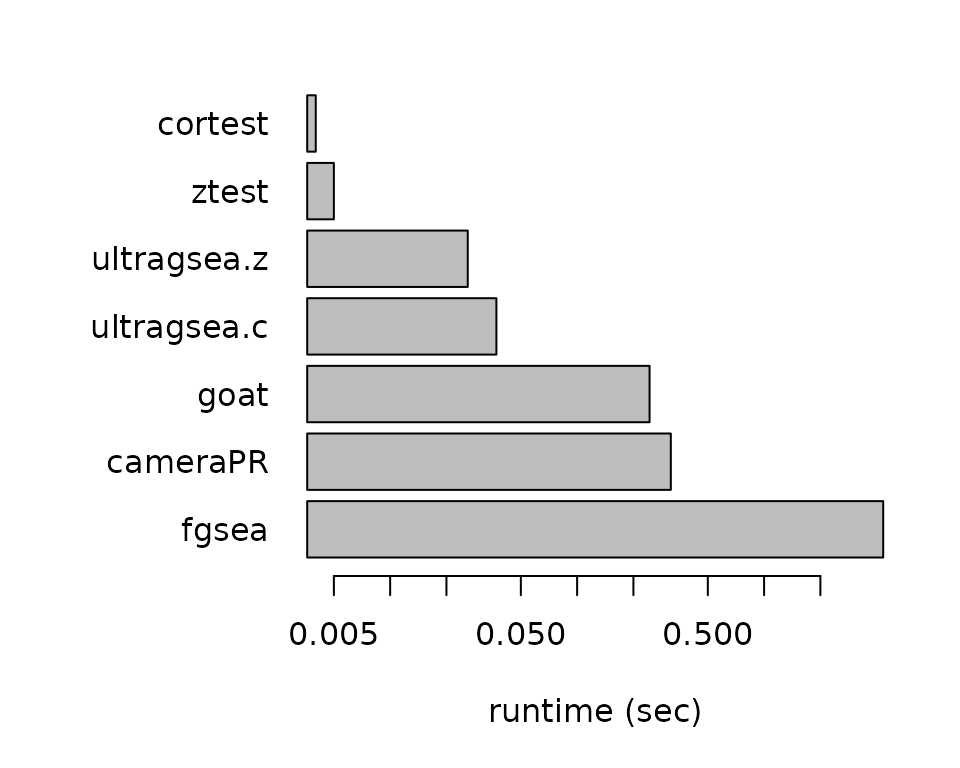

# Comparing with other methods

## Fast pre-ranked enrichment methods

For comparisons, we selected some of the currently fastest pre-ranked
gene set enrichment algorithms:

- fGSEA (fast GSEA). fGSEA is currently perhaps the most widely used
  algorithm for pre-ranked enrichment testing. See:
  [github](https://github.com/alserglab/fgsea)
  [bioRxiv](https://www.biorxiv.org/content/10.1101/060012v3)

- cameraPR (pre-ranked Camera from the limma package). A version of the
  Camera method for pre-ranked lists. See:
  [paper](https://academic.oup.com/nar/article/40/17/e133/2411151)

- GOAT (Gene set Ordinal Association Test). A very fast method using
  precomputed null distributions. See:
  [paper](https://www.nature.com/articles/s42003-024-06454-5)
  [github](https://github.com/ftwkoopmans/goat).

In particular we are interested as how we compare to these algorithms in
terms of runtime, score and p-value.

## Preparing the sparse gene set matrix

For this benchmark we use the example dataset from the `fgsea` package
which includes some examples gene sets `examplePathways` (1457 sets) and
an example ranked list `exampleRanks` (12000 genes). We filter out gene
sets with less than 10 genes, partly because GOAT cannot handle these.
After filtering, we retain 761 gene sets.

``` r
library(fgsea)
library(goat)
#> Loading required package: dplyr
#> 
#> Attaching package: 'dplyr'
#> The following objects are masked from 'package:stats':
#> 
#>     filter, lag
#> The following objects are masked from 'package:base':
#> 
#>     intersect, setdiff, setequal, union
library(ultragsea)
#> 
#> Attaching package: 'ultragsea'
#> The following object is masked from 'package:fgsea':
#> 
#>     fgsea
data(examplePathways)
data(exampleRanks)
fc = exampleRanks
gmt = examplePathways
range(sapply(gmt,length))
#> [1]    1 2366
gmt <- lapply(gmt, function(s) intersect(s,names(fc)))
gmt <- gmt[sapply(gmt,length)>=10]
G <- gmt2mat(gmt)
length(fc)
#> [1] 12000
length(gmt)
#> [1] 761
```

## Running the methods

Run the code below if you want to increase the number of gene sets for
testing.

``` r
if(0) {
  ## run this to increase the number of gene sets.
  gmt <- rep(gmt,40)
  length(gmt)
  names(gmt) <- make.unique(names(gmt))
  G <- do.call(cbind, rep(list(G),40))
  colnames(G) <- make.unique(colnames(G))
  dim(G)
}
```

For benchmarking, we use peakRAM to measure runtime and memory usage of
each method.

``` r
library(peakRAM)
gs <- names(gmt)
tt <- peakRAM::peakRAM(
  res.fgsea <- fgsea::fgsea(gmt, fc, eps=0),
  res.cameraPR <- limma::cameraPR(fc, gmt, use.ranks=FALSE)[gs,],
  res.ultragsea.z <- ultragsea(G, fc, method='ztest')[gs,],
  res.ultragsea.c <- ultragsea(G, fc, method='cor')[gs,],
  res.cortest <- gset.cor(G, fc, compute.p=TRUE, use.rank=FALSE),
  res.ztest <- gset.ztest(G, fc),
  res.goat <- goat(gmt, fc, filter=FALSE)
)
tt[,1] <- gsub("res[.]|<-.*","",tt[,1])
kableExtra::kable(tt)
```

| Function_Call | Elapsed_Time_sec | Total_RAM_Used_MiB | Peak_RAM_Used_MiB |
|:--------------|-----------------:|-------------------:|------------------:|
| fgsea         |            4.254 |                4.1 |              43.9 |
| cameraPR      |            0.323 |                0.7 |              42.4 |
| ultragsea.z   |            0.026 |                0.2 |               5.9 |
| ultragsea.c   |            0.037 |                0.9 |               9.4 |
| cortest       |            0.004 |                0.0 |               2.7 |
| ztest         |            0.005 |                0.0 |               2.8 |
| goat          |            0.243 |                4.5 |              23.7 |

``` r
rt <- tt[,2]
names(rt) <- tt[,1]
par(mar=c(5,8,2,2))
barplot(sort(rt,decreasing=TRUE), horiz=TRUE, las=1, log="x",
  xlab="runtime (sec)")
```



## Comparing the scores

We can compare the scores between the methods. We see that all scores
are very correlated to each other. CameraPR does not return a score
value, so for the score we computed `-log(p)*sign` as its score. Before
plotting we need to make sure all results tables are aligned.

``` r
res.fgsea <- res.fgsea[match(gs,res.fgsea$pathway),]
res.goat <- res.goat[match(gs,res.goat$pathway),]
res.cameraPR$score <- -log(res.cameraPR$PValue)*(-1+2*(res.cameraPR$Direction=="Up"))

Z <- cbind(
  fgsea = res.fgsea$NES,
  cameraPR = res.cameraPR$score,
  ultragsea.z = res.ultragsea.z$score,
  ultragsea.c = res.ultragsea.c$score,
  goat = res.goat$score
)
pairs(Z, pch='.',cex=4)
```


Notice the gap and the particular S-curve that fgsea shows. Also
cameraPR shows some curve compared to the others. We can compare them
better by comparing the ranks of the scores:

``` r
pairs(apply(Z,2,rank), pch='.',cex=4)
```


## Comparing the p-values

Next, we can compare the p-values between the methods. Also here, we see
that all p-values are highly correlated to each other.

``` r
P <- cbind(
  fgsea = res.fgsea$pval,
  cameraPR = res.cameraPR$PValue,
  ultragsea.z = res.ultragsea.z$pval,
  ultragsea.c = res.ultragsea.c$pval,
  goat = res.goat$pval
)
mlp <- -log10(P)
pairs(mlp, pch='.',cex=4)
```


### Replacing fgsea

Much of the slowness of fgsea can be attributed to the permutations for
calculating the p-values. In the previous section, we have seen that the
p-values from ultragsea (both cor and z-test) follow quite well those of
fgsea. Therefore, to make fgsea::fgsea() faster, we can instead
calculate the p-values using ultragsea. We created a replacement
function for ultragsea::fgsea() that is 8-10x faster that the original
fgsea::fgsea()

``` r
system.time(res1 <- fgsea::fgsea(gmt, fc))
#>    user  system elapsed 
#>   5.543   0.078   3.592
system.time(res2 <- ultragsea::fgsea(gmt, fc))
#>    user  system elapsed 
#>   0.222   0.112   0.267
```
