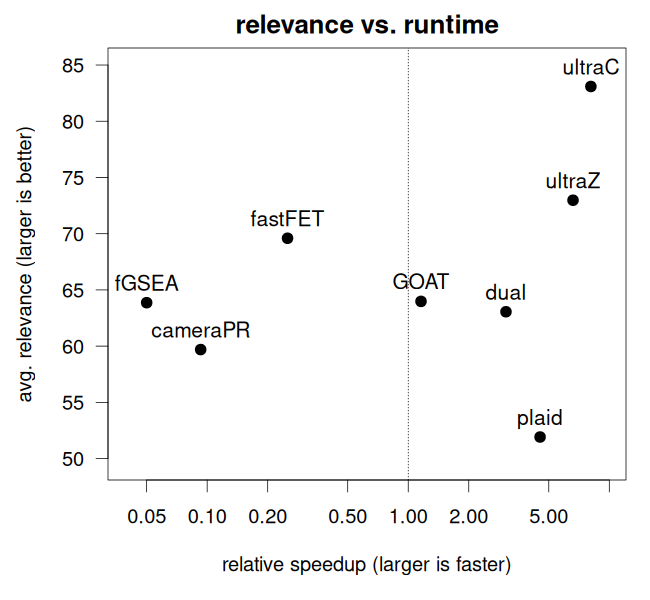
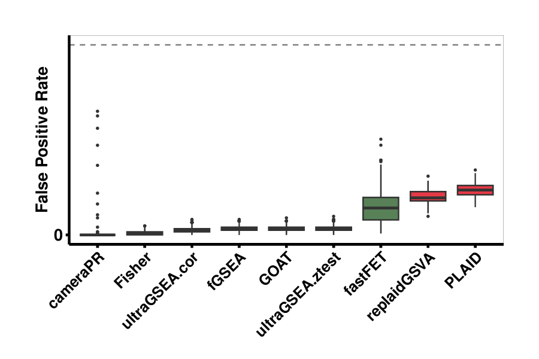
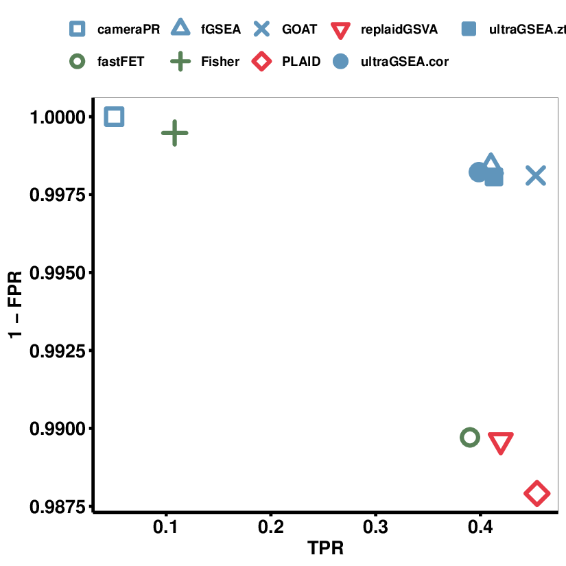

```{r, include = FALSE}
knitr::opts_chunk$set(
  collapse = TRUE,
  comment = "#>",
  fig.align = "center",
  fig.height = 4,
  fig.width = 5,
  fig.fullwidth = TRUE
)
```


# GSEABenchmarkeR

The GSEABenchmarkeR package
([BioC](https://bioconductor.org/packages/release/bioc/html/GSEABenchmarkeR.html),
[github](https://github.com/waldronlab/GSEABenchmarkeR)) implements an
extendable framework for reproducible evaluation of enrichment methods
of gene expression data. It includes a comprehensive real data
compendia (microarray and RNA-seq) of test datasets. Methods can then
be assessed with respect to runtime, statistical significance, and
relevance of the results for the phenotypes investigated.

GSEABenchmarkeR measures the 'relevance' of an algorithm by comparing
the significantly detected gene sets against a list of 'validated
genesets' in a collection of reference datasets. Somehow this is a
measure of the true positive rate (TPR). Benchmarking was conducted
using the GSEABenchmarkeR package on 42 GEO data sets and a total of
12498 gene sets (GO and KEGG collections). We ran the following
methods through the benchmark:

1. UltraC: ultragsea with correlation test.
2. UltraZ: ultragsea with z-test.
3. fastFET: a fast implementation of Fisher Exact test (from the
   corpora R package) based on the hypergeometric function `phyper`.
4. GOAT: see corresponding R package.
5. cameraPR: preranked camera from the limma R package.
6. fGSEA: fast GSEA from the `fgsea` R package

From **Figure 1** we see that ultragsea methods (ultraC and ultraZ)
are the fastest. While in **Figure 2** we can see that ultraC achieves
the highest relevance compared to the others.





# EAbenchmark


The
[EAbenchmark](https://bitbucket.org/sonnhammergroup/eabenchmark/src/master/)
R package, presents a generalized benchmark for evaluating enrichment
analysis (EA) methods, utilizing a diverse set of 82 gene expression
datasets across 26 diseases, with a balanced representation of
non-cancer conditions. EAbenchmark introduces the Disease Pathway
Network, which links related KEGG pathways for evaluation, enabling
assessment of the TPR/FPR of EA methods.

EAbenchmark evaluates the false positive rate (FPR) performance of the
EA methods on randomized data (see **Figure 3**). An ideal method would
not report any significantly enriched gene sets.

**Figure 4** plot the distribution of p-values of the methods under the
null hypothesis. Enrichment analysis methods should produce P-values
that are uniformly distributed but in practice they are either biased
toward 0 or 1 or exhibit a bimodal distribution biased toward both
extremes. Such a bias can affect the significance of the analysis,
hence we examined the distribution of P-values for each method to see
if it was right- or left-skewed. A right-skewed distribution (P-values
biased toward 0) can potentially lead to false positives by reporting
pathways as impacted when they are not. Conversely, a left-skewed
distribution (P-values biased toward 1) can lead to false negatives by
reporting pathways as not significant when they are actually impacted.

By plotting true positive rate (TPR) against FPR we can
visually determine the method with highest TPR and lowest FPR (**Figure 5**). We see that GOAT performs the best with similar low FPR but
slightly higher TPR than fGSEA, and the ultraGSEA methods. fastFET and
the single-sample enrichment methods (PLAID and replaidGSVA) had
similar TPR but higher FPR (although still very small, well below 2%).

Finally, **Figure 6** shows the runtimes of the methods. The ultragsea methods are almost 100x faster than fGSEA and about 10x faster than cameraPR and the naively implemented ORA
Fisher's exact test (Fisher). PLAID, our single-sample enrichment method, is still very fast. The ultragsea methods (ultraGSEA.cor and
ultraGSEA.ztest) and fastFET (hypergeometric-base Fisher's Exact
test) are the fastest.








