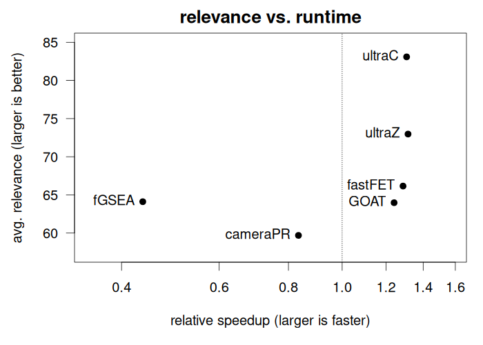

```{r, include = FALSE}
knitr::opts_chunk$set(
  collapse = TRUE,
  comment = "#>",
  fig.align = "center",
  fig.height = 4,
  fig.width = 5,
  fig.fullwidth = TRUE
)
```


# GSEABenchmarkeR

The GSEABenchmarkeR package
([BioC](https://bioconductor.org/packages/release/bioc/html/GSEABenchmarkeR.html),
[github](https://github.com/waldronlab/GSEABenchmarkeR)) implements an
extendable framework for reproducible evaluation of set- and
network-based methods for enrichment analysis of gene expression
data. This includes support for the efficient execution of these
methods on comprehensive real data compendia (microarray and RNA-seq)
using parallel computation on standard workstations and institutional
computer grids. Methods can then be assessed with respect to runtime,
statistical significance, and relevance of the results for the
phenotypes investigated.


{width=45%}
{width=45%}


For this benchmark we use the example dataset from the `fgsea` package
which includes some examples gene sets `examplePathways` (1457 sets)
and an example ranked list `exampleRanks` (12000 genes). We filter out
gene sets with less than 10 genes, partly because GOAT cannot handlue
these. After filtering, we retain 761 gene sets.

```{r}
library(ultragsea)
```


# EAbenchmark


[EAbenchmark](https://bitbucket.org/sonnhammergroup/eabenchmark/src/master/)


{width=45%}
{width=45%}


